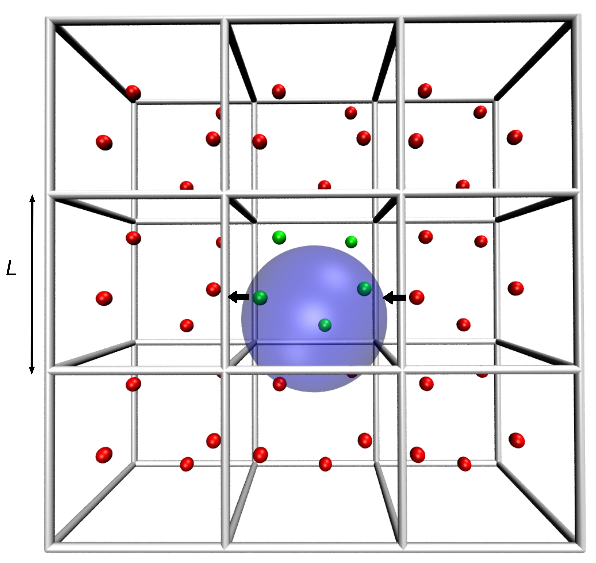

### Chemical Simulations 

##### Why work with computer-aided methods?
The main goal of computer-aided methods in chemistry and material design is to obtain information about chemical system by modeling atoms, molecules and ions on the computer.

##### Advantages of computer-aided methods:
- Cost-effective
- Possibility of studying systems of interest on the atomic level
- Ability to simulate conditions that are difficult to achieve experimentally

##### Molecular Dynamics (MD) Simulations
Description of the time evolution of chemical systems by propagation the Newton's equations of motion. 

- Energy and Forces
    - Difference of Molecular Mechanics and Quantum Mechanics

- Bonded and Non-bonded Interactions

- Force Fields

- Equations of Motion

- Molecular Dynamics Loop

- Velocity Verlet Algorithm

- Timestep

- Long-range forces

- Periodic Boundary Conditions (PBC)

